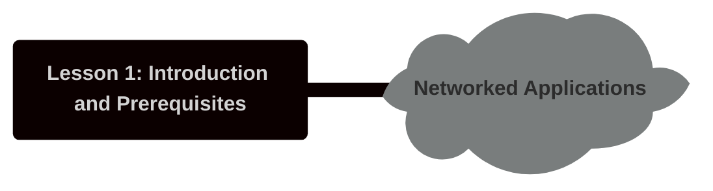

#testing ruby code rendering
```ruby 
puts "hello world"
```

##testing mermaid map mind rendering

```mermaid
%%{init: {'theme':'dark'}}%%
mindmap
root)**Networked Applications**(
		id(**Lesson 1: Introduction and Prerequisites**)
```

###testing markdown rending in Github
